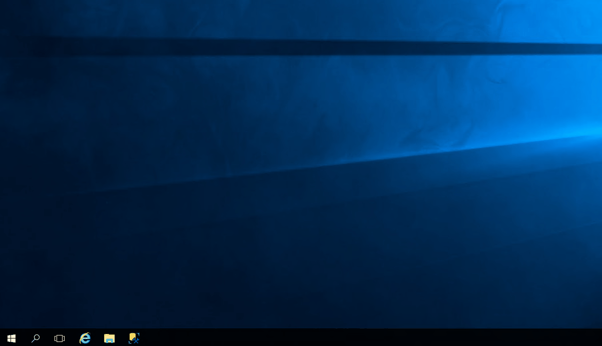

## Server
First we’re going to set up our server and environment. 

Allocate a Windows server with the following specifications: 

Windows Server 2016 
Processor: Intel(R) Xeon(R) CPU E5-2630 v2 @ 2.60GHz (4 processors) 
Installed memory (RAM): 16.00GB minimum, more preferred 
System type: 64-bit Operating System, x64-based processor 
Disk Storage: 500GB will be adequate, 1TB preferred

Download and install: 

.Net Core Hosting Bundle v2.2.x
SQL Server Express 2017
ISS v7
SSMS 18.4

### Enable Internet Information Services (IIS)

1. In the Server Manager, navigate to Add Roles and Features (this will launch the Add Roles and Features wizard)

2. In the menu pane, select Server Roles and ensure that Web Server (IIS) and all its dropdowns except FTP Server, are selected

3. In the menu pane, select Features and ensure that the following is selected: 
- ISS Hostable Webcore 
- .Net Framework and all its dropdowns

4. Click Install

When prompted to do so, restart the server.

## Database (DB)
Now we’re going to create our databases. 

Download the .bak file for the NCCRD database from the folder in Google Drive, save that file somewhere on your server where you can easily locate it, we’ll need it in a bit:

https://drive.google.com/file/d/1WyUthzIuifApbujmTGiiASpTwRVkVlLS/view?usp=sharing

1. On the server: open Microsoft SQL Server Management Studio (if you haven’t yet, go ahead and install it now: [SSMS 18.4](https://docs.microsoft.com/en-us/sql/ssms/download-sql-server-management-studio-ssms?view=sql-server-ver15#download-ssms)).

2. Locate the Object Explorer Pane, rightclick on Databases and select Restore Database…

3. Under Source, select Device

4. Add your .bak file from where you saved it earlier  

Click OK

To test whether the DB creation was successful, check that there is data in the DB folder (ie by running a query)

Setting up the API

Create a folder inetpub on the drive on your server where you want to store your API files

In inetpub, create another folder called wwwroot, and in there, a folder for each app, respectively: 

NCCRD, NDAO, VMS, MAP

So that you have the path: C:/inetpub/wwwroot/<app name>, for each app. 

For the purpose of this walkthrough we’re using NCCRD as an example, the following steps need to be carried out for NDAO, CSA, MAP and VMS as well.  

Copy the following folder into the location you created for NCCRD, so that you have the path:

C:/inetpub/wwwroot/nccrd/api

https://drive.google.com/drive/folders/120klkLZglAvr3phFKhIdoUT2HjPpldU0?usp=sharing

Copy the following folder into the location you created for NDAO, so that you have the path:

C:/inetpub/wwwroot/ndao/api

https://drive.google.com/drive/folders/1DaeYGR_d4Ij8wNPjcabNhs0tKXcRGU1U?usp=sharing

Copy the following folder into the location you created for VMS, so that you have the path:

C:/inetpub/wwwroot/vms/api

https://drive.google.com/drive/folders/1sUdZr2gPomXRep-o7HCEN1Zd67IkIMQM?usp=sharing

Copy the following folder into the location you created for MAP, so that you have the path:

C:/inetpub/wwwroot/map/

https://drive.google.com/drive/folders/18m0PLH1yjSpC7ubGrkNpcTqQlzBInBNA?usp=sharing

Locate the secrets.json file in NDAO and NCCRD and edit it according to your setup, with your connection strings

Setting up the Clients

Copy the following folder into the location you created for NCCIS, so that you have the path:
     
C:/inetpub/wwwroot/nccis/

https://drive.google.com/drive/folders/1gwZXgcS581aq9p35xfuw9S1nI4ymyaM9?usp=sharing

Copy the following folder into the location you created for NCCRD, so that you have the path:
     
C:/inetpub/wwwroot/nccrd/client

https://drive.google.com/drive/folders/1Z5jaUJd4_lM1WGlfdLMOkfSHAdXh-pJy?usp=sharing

Copy the following folder into the location you created for NDAO, so that you have the path:
     
C:/inetpub/wwwroot/ndao/client

https://drive.google.com/drive/folders/1DdFcdXSCQynmEaRdGqmTa0u-DBoB16xh?usp=sharing

Configure IIS

Open Internet Information Services Manager (IIS)

Locate the Connections pane and expand your server instance by clicking on the dropdown arrow to the left.

Expand Sites and if there is a site called ‘default’, go ahead and delete it, then, rightclick on Sites and select Add Website (this will open the Add Website wizard)

Under Site name: enter the name of your web app, for this walkthrough we’ll use NCCIS, this will be the entry-point application, the rest of the sites will be sub-apps of this main app. 

Under Application Pool, make sure DefaultAppPool is selected

In the Content Directory section set your Physical path to where your compiled files are stored, in this case it is the folder you created in the previous step: C:\inetpub\wwwroot\NCCIS\Client

Click on Connect as… and select Application User

Make sure that Start Website immediately is checked and click OK to complete the process. 

